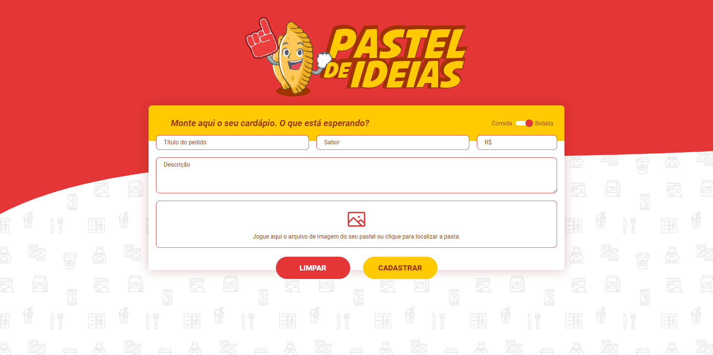

<h1 align="center">Front-End Challenge</h1>

Projeto "Pastel de Ideias", onde o usuário pode criar um cardápio para sua pastelaria. #DeuFome

## Layout do Projeto

## Execução do Projeto
    
    # install dependencies
    $ npm install
    
    # serve with hot reload at localhost:3000
    $ npm run dev

## Tecnologias Utilizadas no Projeto

- HTML, CSS
- JavaScript/TypeScript 
- VueJS 3 com NuxtJS

## Funcionalidades
- [x] O projeto deve ser uma *single page application (SPA)* escrita utilizando Vue ou Nuxt.
- [ ] Campos "título do pedido" e "sabor" devem ser: obrigatorios, do tipo texto, mínimo de 3 e máximo de 60 caracteres.
- [x] Campo "preço" deve ser: obrigatorio e do tipo numero.
- [x] Campo "descrição" deve ser do tipo texto. 
- [ ] Campo "imagem" deve mostrar um preview da imagem ao fazer o upload e aceitar apenas arquivos no formato .jpg ou .png. 
- [ ] Campo "comida para bebida", ao alterar deve manter informações no formulário.
- [ ] Ao clicar no botão "Limpar" todos os campos devem ficar vazios, inclusive a imagem.
- [ ] Ao clicar no botão "Cadastrar" os dados do item devem ir para lista de pedidos, sendo que o último pedido cadastrado deverá ir para o topo.
- [ ] Na lista de pedidos, caso não tenha imagem cadastrada, usar uma padrão.
- [x] Tornar o layout responsivo.